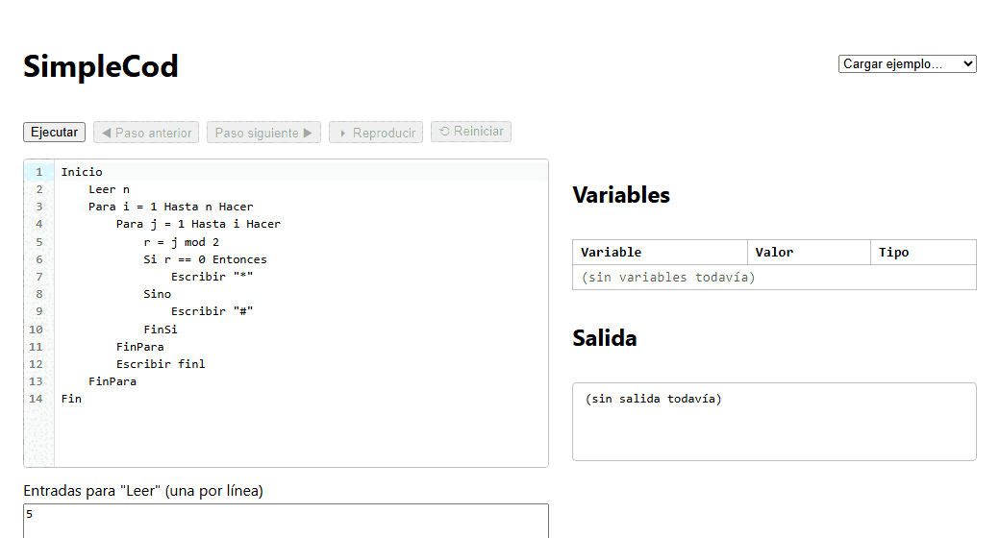
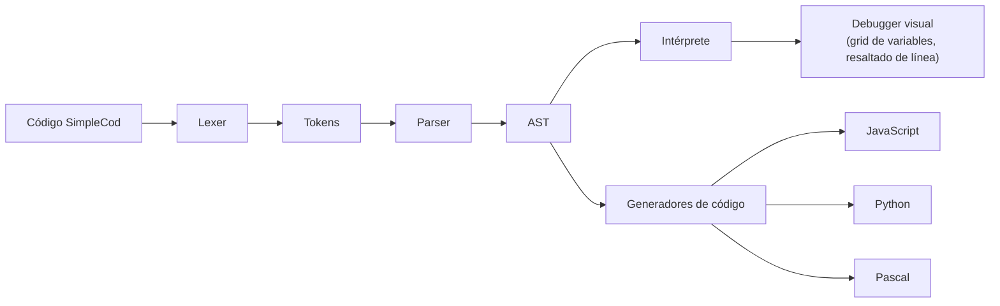

# SimpleCod

**Intérprete web de pseudocódigo en español**, con debugger visual paso a
paso y transpilación del mismo código a JavaScript, Python y Pascal.

🔗 **[Probalo en vivo](https://megatherion.github.io/simplecod/)**



## Historia

SimpleCod nació en 2010-2011 como un intérprete de escritorio escrito en
Borland C++ Builder 6, para ayudar a estudiantes a visualizar cómo corre un
pseudocódigo línea por línea. Aquella versión nunca llegó a tener funciones ni
arreglos — se quedó en el prototipo.

Esta es la reconstrucción moderna, 15 años después: mismo espíritu pedagógico
(pseudocódigo en español, ver las variables cambiar paso a paso), pero ahora
corriendo enteramente en el navegador, con un lexer, parser y AST propios
escritos a mano, funciones y arreglos que la versión original no tuvo, y
transpilación a tres lenguajes reales.

## Qué hace

- **Intérprete** de un lenguaje de pseudocódigo en español (`Inicio`/`Fin`,
  `Si`/`Entonces`/`Sino`, `Para`/`Mientras`, `Funcion`, arreglos con
  `Dimension`) con tipado dinámico.
- **Debugger visual**: ejecutá el programa completo o paso a paso (con
  reproducción automática y "paso atrás"), viendo la línea actual resaltada
  en el editor y la grilla de variables actualizándose en vivo.
- **Errores con línea y columna**, resaltados directamente sobre el editor —
  léxicos, sintácticos y de ejecución.
- **Transpilación en vivo** del mismo AST a JavaScript, Python y Pascal.
- Todo corre en el navegador: no hay backend.

## Arquitectura

Un único AST recorrido por el intérprete y por los tres generadores de
código — lexer y parser escritos a mano, sin librerías de parsing:



`packages/core` implementa lexer → parser → AST → intérprete → codegen en
TypeScript puro (sin React ni DOM, testeable en Node). `packages/web` es la
UI de React que conecta ese núcleo con CodeMirror.

## Stack

TypeScript estricto · React 18 + Vite · CodeMirror 6 · Vitest · npm
workspaces · GitHub Pages (deploy estático, sin backend).

## Correr localmente

```bash
git clone git@github.com:MegaTherion/simplecod.git
cd simplecod
npm install
npm run dev     # levanta la app web (Vite)
npm run test    # corre los tests de packages/core (lexer, parser, intérprete, codegen)
npm run build   # build de producción de ambos paquetes
```

## El lenguaje

```
Inicio
    Leer n
    Si n mod 2 == 0 Entonces
        Escribir n, " es par", finl
    Sino
        Escribir n, " es impar", finl
    FinSi
Fin
```

La especificación completa (léxico, gramática EBNF, precedencia de
operadores, forma del AST y manejo de errores) está en
[`docs/gramatica.md`](docs/gramatica.md).

## Ejemplos

Los programas clásicos usados para probar cada etapa del pipeline están en
[`examples/`](examples/) y se pueden cargar directamente desde la demo
(selector "Cargar ejemplo…"):

- [`asteriscos.scc`](examples/asteriscos.scc) — bucles anidados
- [`es_primo.scc`](examples/es_primo.scc) — función con `Retornar`
- [`promedio_notas.scc`](examples/promedio_notas.scc) — arreglos con `Dimension`
- [`dias_semana.scc`](examples/dias_semana.scc) — literales de arreglo

## Estructura del repo

```
packages/core/   lexer, parser, AST, intérprete, codegen, debugger (TypeScript puro)
packages/web/    app React (editor, grid de variables, panel de salida)
docs/            gramatica.md — especificación normativa del lenguaje
examples/        programas .scc de ejemplo
```
